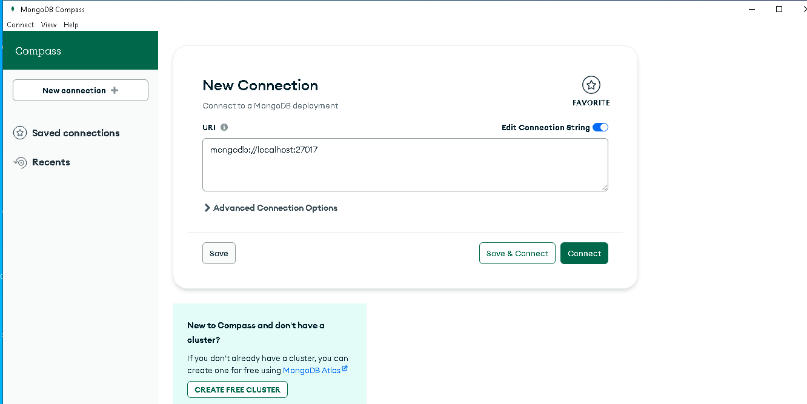
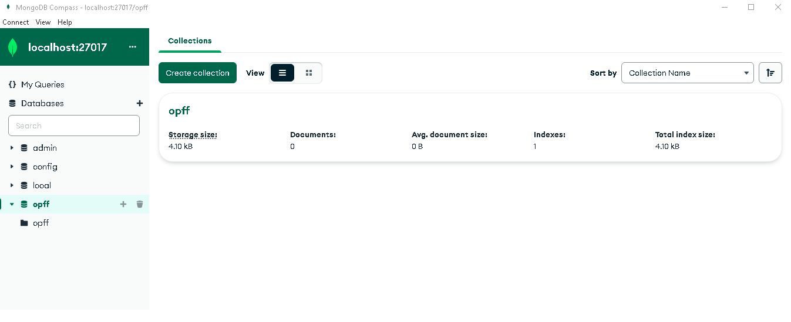
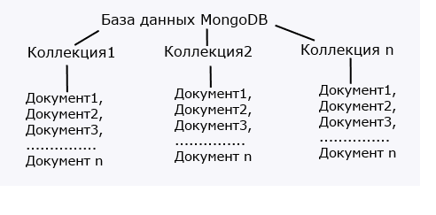
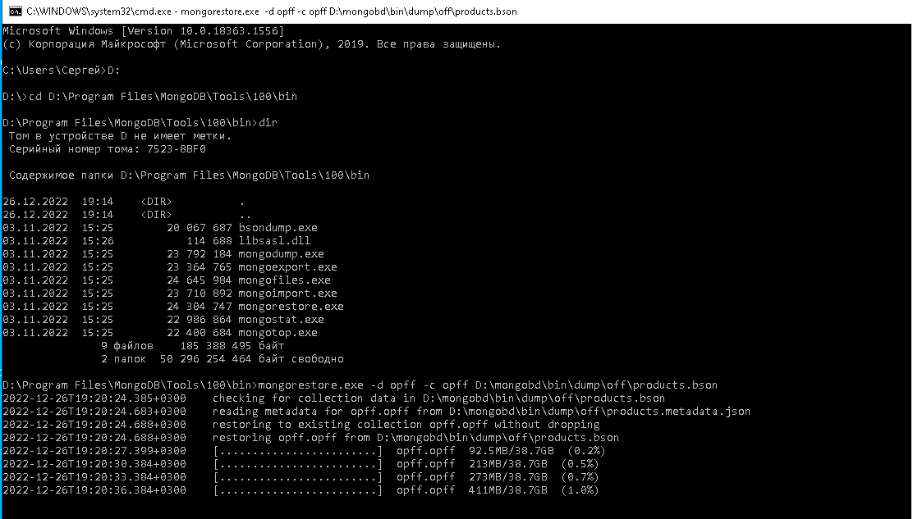
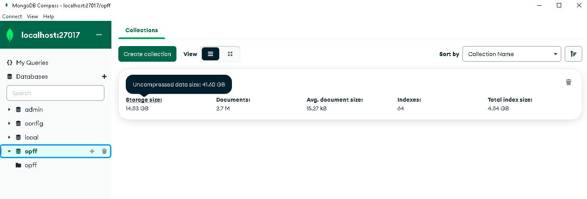

### Формирование базы данных (сбор, фильтрация данных) и синхронизация баз
1. Описание задачи
Есть 2 базы – из Призмы и OpenFoodFacts
Цель этого проекта - сделать 1 общую базу, которую можно будет использовать для приложения. Приложение написано к настоящему времени, но, кончено, еще можно дорабатывать. 
Одна небольшая база уже есть и используется в приложении. Из Призмы – 1 таблица MySQL
Вторая  - json или https://ru.wikipedia.org/wiki/MongoDB 
Json – распарсить и залить в базу (в таблицу) последовательно
Если продукт есть, но нет состава или пищевой ценности, заливаем
Есть штрихкоды, которые начинаются с 2, их не добавляем
2. Возможные методы решения
2.1. Выяснили, что база https://world.openfoodfacts.org/data имеет тип Momgo.db Нужно развернуть Mongo локально, чтобы иметь возможность с ней работать.
Сервер будем скачивать с официального сайта https://www.mongodb.com/try/download/community 
Скачиваем установщик с расширением msi
Это установщик Windows. При установке выбираем нужный диск и нам нужно решить, будет ли Mongo сервисом. В моем случае - выбираю что будет.
После установки видим:

 Нажимает connect и соединемся с локалхостом.
 
 2.2. Нужно разбратьс, как устроена MongoDB https://habr.com/ru/post/103699/ и развернуть ее локально. 
 2.3 Из документации выяснили, что если в реляционных бд содержимое составляют таблицы, то в mongodb база данных состоит из коллекций. 
 
  отличие от реляционных баз данных MongoDB не использует табличное устройство с четко заданным количеством столбцов и типов данных. MongoDB является документо-ориентированной системой, в которой центральным понятием является документ.
Документ представляет набор пар ключ-значение. Например, в выражении "name": "Tom" "name" представляет ключ, а "Tom" - значение.

Ключи представляют строки. Значения же могут различаться по типу данных. В данном случае у нас почти все значения также представляют строковый тип, и лишь один ключ (company) ссылается на отдельный объект. Всего имеется следующие типы значений:

    String: строковый тип данных, (для строк используется кодировка UTF-8)

    Array (массив): тип данных для хранения массивов элементов

    Binary data (двоичные данные): тип для хранения данных в бинарном формате

    Boolean: булевый тип данных, хранящий логические значения TRUE или FALSE, например, {"married": FALSE}

    Date: хранит дату в формате времени Unix

    Double: числовой тип данных для хранения чисел с плавающей точкой

    Integer: используется для хранения целочисленных значений размером 32 бита, например, {"age": 29}

    Long: используется для хранения целочисленных значений размером 64 бита

    JavaScript: тип данных для хранения кода javascript

    Min key/Max key: используются для сравнения значений с наименьшим/наибольшим элементов BSON

    Null: тип данных для хранения значения Null

    Object: объект, который содержит набор свойств

    ObjectId: тип данных для хранения id документа

    Regular expression: применяется для хранения регулярных выражений

    Decimal128: тип данных для хранения десятичных дробных чисел размером 128 бит, которые позволяют решить проблемы с проблемой точности вычислений при использовании дробных чисел, которые представляют тип Double.
    Timestamp: применяется для хранения времени
**Идентификатор документа**

Для каждого документа в MongoDB определен уникальный идентификатор, который называется _id. При добавлении документа в коллекцию данный идентификатор создается автоматически. 
    
Документ можно представить как объект, хранящий некоторую информацию.
В нашем случае документ - json, в то время как скачали мы dump базы. 
2.4. Чтобы развернуть базу (сделать из .bson .json) нужно в командной строке ввести:
mongorestore -d db_name -c collection_name path/file.bson
2.5. Существуют инструменты MondoDB командной строки. Скачиваем их с официального сайта https://www.mongodb.com/try/download/database-tools 
2.6 Запускаем командную строку, вводим команду и получаем:
 
 
2.7. После перезагрузки и запуска MongoDB Compass видим нашу базу
 
3. Имеющиеся форматы данных, приведение к единому формату
4. Выбор технологий для работы
5. Запуск MySQL сервера локально
6. Localhost